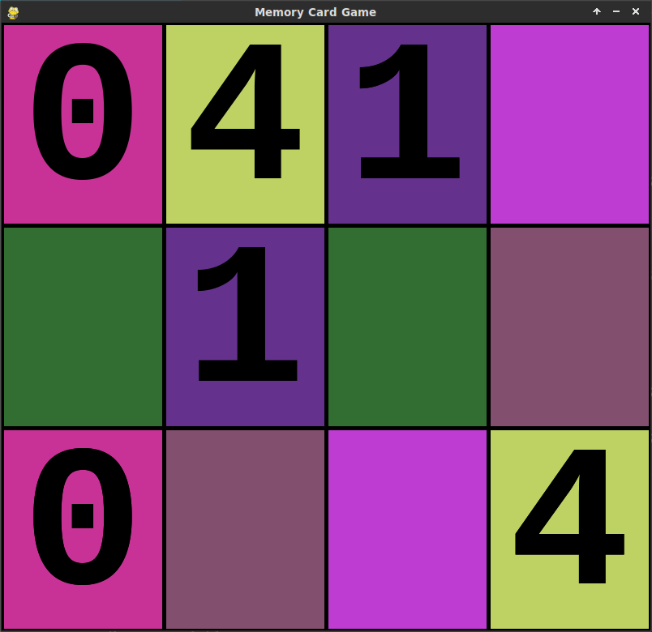
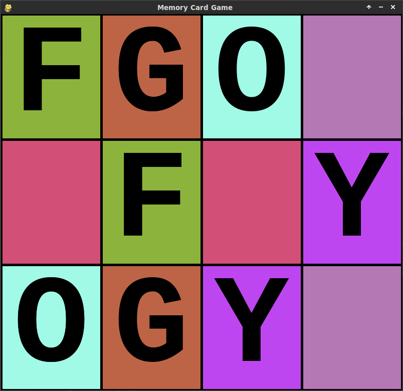
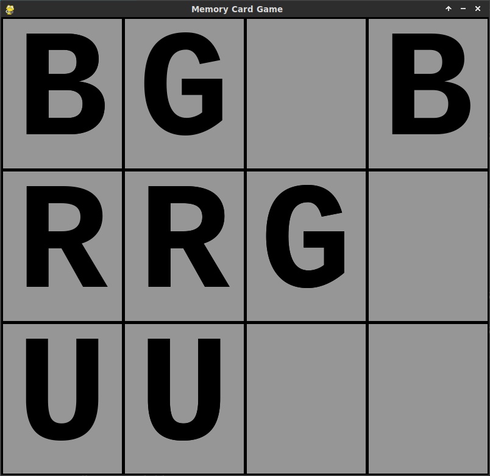
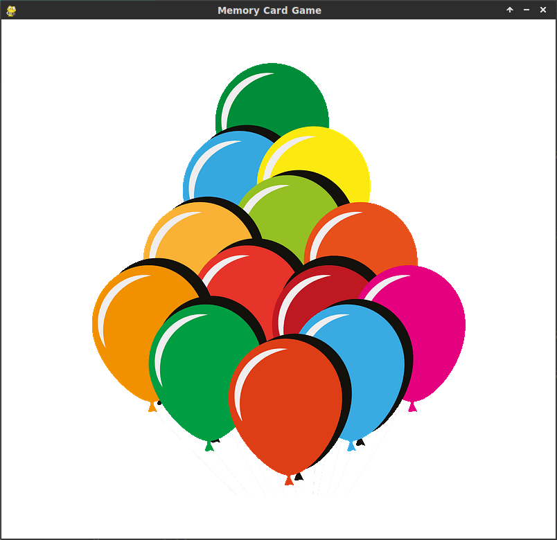

# 🧩 Simple PyGame Memory Card Game (with Sound Effects)

A fun and educational **cross-platform Memory Card Game** built with **PyGame**, designed especially for young children (even under 3 years old).  
The game features multiple levels, starting with colourful hints and progressing toward more challenging monochrome cards — helping children learn **colours, numbers, and letters** while improving memory and focus.

## 🎮 Game Features

- Simple and child-friendly gameplay  
- Progressive difficulty levels  
- Colour-coded hints on early levels  
- Clear and pleasant sound effects  
- Works on Windows, macOS, and Linux

## 🧠 Learning Goals

- Recognise and match **colours**  
- Identify **numbers and letters**  
- Develop **memory** and **concentration**

## ⚙️ Installation and Setup

You’ll need **Python 3** and **PyGame** installed.

- [Download Python](https://www.python.org/downloads/)
- [Learn more about PyGame](https://www.pygame.org)

🧩 Option 1: Quick Install (Recommended for most users)

You can install PyGame directly using pip:

```sh
python3 -m pip install -U pygame==2.6.0
```

Then simply run the game (see below).

🧱 Option 2: Using a Virtual Environment (Recommended for developers)

To keep your system Python clean and isolate dependencies, create and activate a virtual environment:

```bash
python3 -m venv venv
source venv/bin/activate
pip install -r requirements.txt
```

## ▶️ How to Run the Game

Once dependencies are installed, simply run:

```bash
python memory.py
```

## Some screenshots:

<p align="center">
  
  
</p>

<p align="center">
  
  
</p>

Images sources: 
* https://creazilla.com

Sounds sources:
* https://freesound.org
* https://gtts.readthedocs.io/en/latest/index.html

The images edited using Gimp:
* https://www.gimp.org

The sounds edited and converted using Audacity:
* https://www.audacityteam.org
